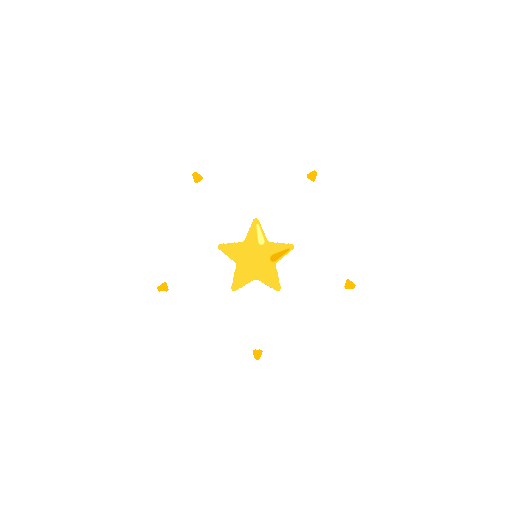
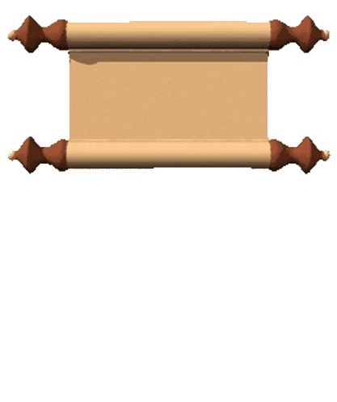
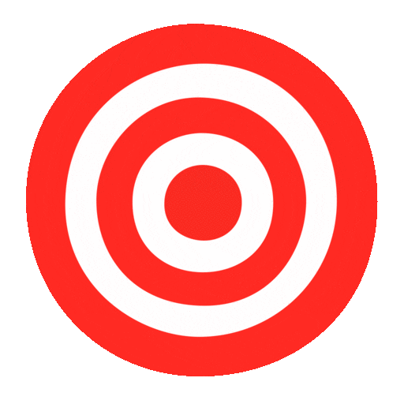
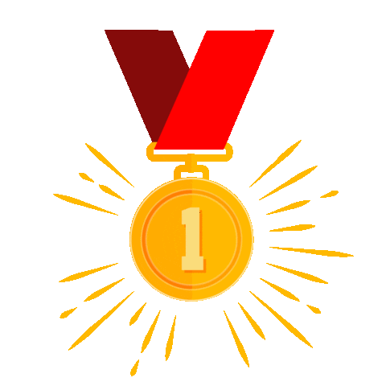
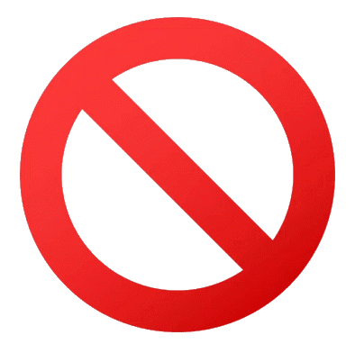
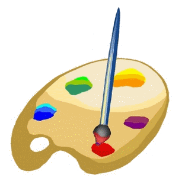
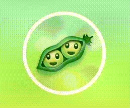
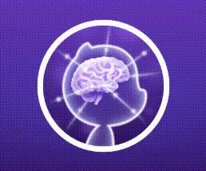
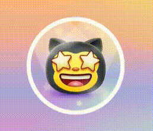

#  GitHub-Achievement-Badges 

 Discover the complete collection of GitHub Profile Badges and Achievements to showcase your contributions and milestones in style!  Elevate your profile by displaying your accomplishments, engaging the community, and celebrating your GitHub journey! 

#  Achievement List

Explore the GitHub Achievement List, featuring categories like Achievements Being Tested, Obtainable Achievements, How to Earn Badges, and the Un-Obtainable Achievements. Showcase your milestones and learn how to earn them all!

##  **Achievements Being Tested: **

Get a sneak peek at upcoming GitHub achievements and badges.  These achievements are still in testing and will be obtainable soon. Be among the first to unlock and showcase these exclusive milestones as you continue to contribute and innovate on the platform. 
| Name | Badge Image | Earnable? | Difficulty | Badge Tiers |
| --- | --- | --- | --- | --- |
Heart On Your Sleeve |  | `⌛Trial` | Very Easy | <table> <thead> <tr> <th>DEFAULT</th> <th>BRONZE</th> <th>SILVER</th> <th>GOLD</th> </tr> </thead> <tbody> <tr> <td align="center"></td>  <td></td> <td></td> <td></td> </tr> <tr> <td align="center">-</td>  <td align="center">-</td> <td align="center">-</td> <td align="center">-</td> </tr> </tbody> </table>
Open Sourcerer |  | `⌛Trial` | Medium | <table> <thead> <tr> <th>DEFAULT</th> <th>BRONZE</th> <th>SILVER</th> <th>GOLD</th> </tr> </thead> <tbody> <tr> <td align="center"></td>  <td></td> <td></td> <td></td> </tr> <tr> <td align="center">-</td>  <td align="center">-</td> <td align="center">-</td> <td align="center">-</td> </tr> </tbody> </table>

##  Obtainable Achievements

The achievements listed below are ones that you can obtain:
| Name | Badge Image | Earnable? | Difficulty | Badge Tiers |
| --- | --- | --- | --- | --- |
Quickdraw |  | `✅ Yes` | Very Easy | <table> <thead> <tr><th>DEFAULT</th> <th>BRONZE</th> <th>SILVER</th> <th>GOLD</th> </tr> </thead> <tbody> <tr> <td align="center"></td> <td></td> <td></td> <td></td> </tr> <tr> <td align="center">1</td> <td align="center">-</td> <td align="center">-</td> <td align="center">-</td> </tr> </tbody> </table> |
Public Sponsor |  | `✅ Yes` | Very Easy | <table> <thead> <tr><th>DEFAULT</th> <th>BRONZE</th> <th>SILVER</th> <th>GOLD</th> </tr> </thead> <tbody> <tr> <td align="center"></td> <td></td> <td></td> <td></td> </tr> <tr> <td align="center">1</td> <td align="center">-</td> <td align="center">-</td> <td align="center">-</td> </tr> </tbody> </table> |
YOLO |  | `✅ Yes` | Easy | <table> <thead> <tr><th>DEFAULT</th> <th>BRONZE</th> <th>SILVER</th> <th>GOLD</th> </tr> </thead> <tbody> <tr> <td align="center"></td> <td></td> <td></td> <td></td> </tr> <tr> <td align="center">1</td> <td align="center">-</td> <td align="center">-</td> <td align="center">-</td> </tr> </tbody> </table> |
Pull Shark |  | `✅ Yes` | Medium | <table> <thead> <tr><th>DEFAULT</th> <th>BRONZE</th> <th>SILVER</th> <th>GOLD</th> </tr> </thead> <tbody> <tr> <td align="center"></td> <td></td> <td></td> <td></td> </tr> <tr> <td align="center">2</td> <td align="center">16</td> <td align="center">128</td> <td align="center">1024</td> </tr> </tbody> </table> |
Pair Extraordinaire	 |  | `✅ Yes` | Medium | <table> <thead> <tr><th>DEFAULT</th> <th>BRONZE</th> <th>SILVER</th> <th>GOLD</th> </tr> </thead> <tbody> <tr> <td align="center"></td> <td></td> <td></td> <td></td> </tr> <tr> <td align="center">1</td> <td align="center">10</td> <td align="center">24</td> <td align="center">48</td> </tr> </tbody> </table> |
Galaxy Brain |  | `✅ Yes` | Medium | <table> <thead> <tr><th>DEFAULT</th> <th>BRONZE</th> <th>SILVER</th> <th>GOLD</th> </tr> </thead> <tbody> <tr> <td align="center"></td> <td></td> <td></td> <td></td> </tr> <tr> <td align="center">2</td> <td align="center">8</td> <td align="center">16</td> <td align="center">32</td> </tr> </tbody> </table> |
Starstruck |  | `✅ Yes`| Hard | <table> <thead> <tr><th>DEFAULT</th> <th>BRONZE</th> <th>SILVER</th> <th>GOLD</th> </tr> </thead> <tbody> <tr> <td align="center"></td> <td></td> <td></td> <td></td> </tr> <tr> <td align="center">16</td> <td align="center">128</td> <td align="center">512</td> <td align="center">4096</td> </tr> </tbody> </table> |


##  How to Earn Badges

Learn how to earn badges on GitHub by contributing to projects, engaging with the community, and more. The achievements listed below are ones that you can obtain, showcasing your efforts and milestones on the platform.
| Name | Badge Image | Earned By |
| --- | --- | --- |
Heart On Your Sleeve |  | User obtain this badge by reacting to something on GitHub with a  emoji |
Open Sourcerer |  | Can be obtained if a user had Pull Requests merged in more than 1 public repository |
Quickdraw |  | Obtainable by closing a Pull Request or Issue in 5 mins of it being opened.<br>**(You can close your own issues)** |
Public Sponsor |  | This badge can be earned by sponsoring a repository/organization/user. |
YOLO |  | A user can obtain this badge by merging a pull request without a review<br>**(This requires 1 user and 1 reviewer via Collaborating)** |
Pull Shark |  | You can get this badge by merging 2 pull requests. |
Pair Extraordinaire	 |  | The user can obtain this badge by [Coauthoring](https://docs.github.com/pull-requests/committing-changes-to-your-project/creating-and-editing-commits/creating-a-commit-with-multiple-authors) in a merged pull request.<br> **(Must: Requires GitHub Desktop App)** |
Galaxy Brain |  | A user can get this badge by getting 2 of their answers accepted on the [Community Discussions](https://github.com/orgs/community/discussions/) forum. |
Starstruck |  | This badge is given to someone when one of their repository's gets 16 stars. |
Mars 2020 Contributor |  | Contributed code to repositories used in the [Mars 2020 Helicopter Mission](https://github.com/readme/featured/nasa-ingenuity-helicopter).<br/>**(Now unable to earn)**  |
Arctic Code Vault Contributor |  | Contributed code to a repository in the [2020 GitHub Archive Program](https://archiveprogram.github.com/).<br/>**(Now unable to earn)** |

##  Un-Obtainable Achievements

Un-Obtainable Achievements are badges that were once available but can no longer be earned.These achievements are part of GitHub's history, showcasing milestones that are now preserved as legacy accomplishments .
| Name | Badge Image | Earnable? | Difficulty | Badge Tiers |
| --- | --- | --- | --- | --- |
Arctic Code Vault Contributor |  | `❌ No` |  Very Easy | <table> <thead> <tr><th>DEFAULT</th> <th>BRONZE</th> <th>SILVER</th> <th>GOLD</th> </tr> </thead> <tbody> <tr> <td align="center"></td> <td></td> <td></td> <td></td> </tr> <tr> <td align="center">1</td> <td align="center">-</td> <td align="center">-</td> <td align="center">-</td> </tr> </tbody> </table> |
Mars 2020 Contributor |  | `❌ No` | Easy | <table> <thead> <tr><th>DEFAULT</th> <th>BRONZE</th> <th>SILVER</th> <th>GOLD</th> </tr> </thead> <tbody> <tr> <td align="center"></td> <td></td> <td></td> <td></td> </tr> <tr> <td align="center">1</td> <td align="center">-</td> <td align="center">-</td> <td align="center">-</td> </tr> </tbody> </table> |

#  Tier Colors & Labels

Every tier has either an x2, x3, or x4 label with it that also includes color. Here is the information about each one below:

| Tier | Label | Sample | Hex | Visual |
| --- | --- | --- | --- | --- |
🥉 Bronze | `x2` |  | `#F9BFA7` | 
🥈 Silver | `x3` |  | `#E1E4E4` | 
🥇 Gold | `x4` |  | `#FAE57E` | 

#  Achievement Skin Tone

Some of the achievements on GitHub appear on different skin color depending on your Emoji Skin Tone Preference.<br/>
You can change your preferred Skin Tone by going to the [appearance settings](https://github.com/settings/appearance).

| Badge | Name | Skin Tone Versions | 
| :-: | :-: | :-: |
|  | Starstruck | <table> <tbody> <tr> <td align="center"></td> <td align="center"></td> <td align="center"></td> <td align="center"></td> <td align="center"></td> <td align="center"></td> </tr> <tr> <td align="center">👋</td> <td align="center">👋🏻</td>  <td align="center">👋🏼</td>  <td align="center">👋🏽</td>  <td align="center">👋🏾</td>  <td align="center">👋🏿</td> </tr> </tbody> </table> |
|  | Quickdraw | <table><tbody> <tr> <td align="center"></td> <td align="center"></td> <td align="center"></td> <td align="center"></td> <td align="center"></td> <td align="center"></td> </tr> <tr> <td align="center">👋</td> <td align="center">👋🏻</td><td align="center">👋🏼</td> <td align="center">👋🏽</td><td align="center">👋🏾</td><td align="center">👋🏿</td></tr> </tbody> </table> |

#  Highlights Badges 

Highlights Badges showcase your most impressive achievements and contributions on GitHub.  These special badges celebrate significant milestones and standout accomplishments, drawing attention to your key contributions and expertise. 
| Badge | Name | Is it possible to get? | How to achieve |
| --- | --- | --- | --- |
|  | **Pro** | ✅ Yes | Use [GitHub Pro](https://docs.github.com/en/get-started/learning-about-github/githubs-products#github-pro) |
|  | **Developer Program Member** | ✅ Yes | Be a registered member of the [GitHub Developer Program](https://docs.github.com/en/developers/overview/github-developer-program) |
|  | **Security Bug Bounty Hunter** | ✅ Yes | Helped out hunting down security vulnerabilities at [GitHub Security](https://bounty.github.com/) |
| ![Light badge GitHub Campus Expert][gce-dark]![Dark badge GitHub Campus Expert][gce-light] | **GitHub Campus Expert** | ❌ No | Participate in the [GitHub Campus Program](https://education.github.com/experts) (will open [in August 2024](https://education.github.com/campus_experts)) |
| ![Dark badge Security advisory credit][SAC-dark]![Light badge Security advisory credit][SAC-light] | **Security Advisory Credit** | ✅ Yes | Have your security advisory submitted to the [GitHub Advisory Database](https://github.com/advisories) accepted |
| ![Dark badge Github Stars][stars-dark]![Light badge Github Stars][stars-light] | **GitHub Star** | ✅ Yes | Become a [GitHub Star](https://stars.github.com) |
|  | **Discussion answered** | ❌ No | Have  your reply to a discussion marked as the answer |

[gce-dark]: https://user-images.githubusercontent.com/65187002/173082819-b3625c23-bfd6-4492-b828-56ed91c45f52.svg#gh-dark-mode-only
[gce-light]: https://user-images.githubusercontent.com/65187002/173082836-08be81fe-13b7-4acf-9096-e5241d76f237.svg#gh-light-mode-only
[SAC-dark]: https://user-images.githubusercontent.com/65187002/173084051-79a0a626-1c1a-4d60-afdf-50ad001d7b21.svg#gh-dark-mode-only
[SAC-light]: https://user-images.githubusercontent.com/65187002/173084071-5f321da2-b2a9-490b-a524-1b21fa384d7e.svg#gh-light-mode-only
[stars-dark]: https://raw.githubusercontent.com/UjjwalSaini07/GitHub-Achievement-Badges/0e152f88d892e6fe5122358253ecb0ae9926c0f8/Assests/Extra/stars-dark.svg#gh-dark-mode-only
[stars-light]: https://raw.githubusercontent.com/UjjwalSaini07/GitHub-Achievement-Badges/28cbfeadd11b7440c1347a3da92c5a9b7a805249/Assests/Extra/stars-light.svg#gh-light-mode-only

#  More information 

🔍 Discover details on all available badges, including the four tiers that showcase your achievements.  From beginner to expert, see how each badge represents different levels of accomplishment and contribution. 
| PairExtraordinaire Badge | PullShark Badge | GalaxyBrain Badge | Starstruck Badge |
| --- | --- | --- | --- |
|  |  |  |  |

#  Previous Names

Only 2 achievements had their name altered in all of GitHub's History. These 2 achievements are the Public Sponsor and Mars 2020 Contributor as follows:
```diff
- GitHub Sponsor
+ Public Sponsor

- Mars 2020 Helicopter Contributor
+ Mars 2020 Contributor
```

#  Credits
- Massive credit goes to @Schweinepriester for the high quality images for each badge, labels, information for each badge, and the inspiration to make this repository and Help other to get Badges and make their GitHub Profile best.
- Credit to @drknzz for the skin tone images.

#  Any Problem 
- Refer this main GitHub Document [Link](https://docs.github.com/en/account-and-profile/setting-up-and-managing-your-github-profile/customizing-your-profile/personalizing-your-profile#displaying-badges-on-your-profile)
- Feel Free to Contact Me to Solve your problem [Mail-ID](mailto:ujjwalsaini0007@gmail.com)
- Thank u to use this Repository.
- <span>Show Some love  by Starring ✯ the repo.</span>
- Feel free to Raise [Issue](https://github.com/UjjwalSaini07/GitHub-Achievement-Badges/issues/new)
