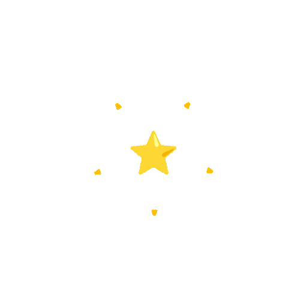
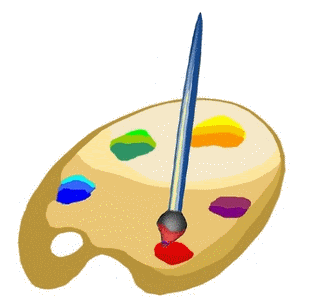

#  GitHub Achievement Badges 
 Discover the complete collection of GitHub Profile Badges and Achievements to showcase your contributions and milestones in style!  Elevate your profile by displaying your accomplishments, engaging the community, and celebrating your GitHub journey! 
##  Achievement List
Explore the GitHub Achievement List, featuring categories like **Achievements Being Tested**, **Obtainable Achievements**, **How to Earn Badges**, and **Un-Obtainable Achievements**. Showcase your milestones and learn how to earn them all!
###  Achievements Being Tested

Get a sneak peek at upcoming GitHub achievements and badges.  These achievements are still in testing and will be obtainable soon. Be among the first to unlock and showcase these exclusive milestones as you continue to contribute and innovate on the platform.

| Name                  | Badge Image                                                                                                 | Earnable? | Difficulty | Badge Tiers |
| --------------------- | ----------------------------------------------------------------------------------------------------------- | --------- | ---------- | ---------- |
| Heart On Your Sleeve  |  | `⌛Trial`  | Very Easy  |  <table> <thead> <tr> <th>DEFAULT</th> <th>BRONZE</th> <th>SILVER</th> <th>GOLD</th> </tr> </thead> <tbody> <tr> <td align="center"></td>  <td></td> <td></td> <td></td> </tr> <tr> <td align="center">-</td>  <td align="center">-</td> <td align="center">-</td> <td align="center">-</td> </tr> </tbody> </table> |
| Open Sourcerer        |  | `⌛Trial`  | Medium     | <table> <thead> <tr> <th>DEFAULT</th> <th>BRONZE</th> <th>SILVER</th> <th>GOLD</th> </tr> </thead> <tbody> <tr> <td align="center"></td>  <td></td> <td></td> <td></td> </tr> <tr> <td align="center">-</td>  <td align="center">-</td> <td align="center">-</td> <td align="center">-</td> </tr> </tbody> </table> |

###  Obtainable Achievements

The achievements listed below are ones that you can obtain:

| Name               | Badge Image                                                                                                         | Earnable? | Difficulty | Progress |
| ------------------ | ------------------------------------------------------------------------------------------------------------------- | --------- | ---------- | -------- |
| **Quickdraw**      |  | ✅ Yes | Very Easy | <table><thead><tr><th>DEFAULT</th><th>BRONZE</th><th>SILVER</th><th>GOLD</th></tr></thead><tbody><tr><td align="center"></td><td></td><td></td><td></td></tr><tr><td align="center">1</td><td align="center">-</td><td align="center">-</td><td align="center">-</td></tr></tbody></table> |
| **Public Sponsor** |  | ✅ Yes | Very Easy | <table><thead><tr><th>DEFAULT</th><th>BRONZE</th><th>SILVER</th><th>GOLD</th></tr></thead><tbody><tr><td align="center"></td><td></td><td></td><td></td></tr><tr><td align="center">1</td><td align="center">-</td><td align="center">-</td><td align="center">-</td></tr></tbody></table> |
| **YOLO**           |  | ✅ Yes | Easy | <table><thead><tr><th>DEFAULT</th><th>BRONZE</th><th>SILVER</th><th>GOLD</th></tr></thead><tbody><tr><td align="center"></td><td></td><td></td><td></td></tr><tr><td align="center">1</td><td align="center">-</td><td align="center">-</td><td align="center">-</td></tr></tbody></table> |
| **Pull Shark**     |  | ✅ Yes | Medium | <table><thead><tr><th>DEFAULT</th><th>BRONZE</th><th>SILVER</th><th>GOLD</th></tr></thead><tbody><tr><td align="center"></td><td></td><td></td><td></td></tr><tr><td align="center">2</td><td align="center">16</td><td align="center">128</td><td align="center">1024</td></tr></tbody></table> |
| **Pair Extraordinaire** |  | ✅ Yes | Medium | <table><thead><tr><th>DEFAULT</th><th>BRONZE</th><th>SILVER</th><th>GOLD</th></tr></thead><tbody><tr><td align="center"></td><td></td><td></td><td></td></tr><tr><td align="center">1</td><td align="center">10</td><td align="center">24</td><td align="center">48</td></tr></tbody></table> |
| **Galaxy Brain**   |  | ✅ Yes | Medium | <table><thead><tr><th>DEFAULT</th><th>BRONZE</th><th>SILVER</th><th>GOLD</th></tr></thead><tbody><tr><td align="center"></td><td></td><td></td><td></td></tr><tr><td align="center">2</td><td align="center">8</td><td align="center">16</td><td align="center">32</td></tr></tbody></table> |
| **Starstruck**     |  | ✅ Yes | Hard | <table><thead><tr><th>DEFAULT</th><th>BRONZE</th><th>SILVER</th><th>GOLD</th></tr></thead><tbody><tr><td align="center"></td><td></td><td></td><td></td></tr><tr><td align="center">16</td><td align="center">128</td><td align="center">512</td><td align="center">4096</td></tr></tbody></table> |

###  How to Earn Badges

	@@ -51,21 +51,20 @@ Un-Obtainable Achievements are badges that were once available but can no longer

| Name                       | Badge Image                                                                                                               | Earnable? | Difficulty |
| -------------------------- | ------------------------------------------------------------------------------------------------------------------------- | --------- | ---------- |
| Arctic Code Vault Contributor |  | `❌ No`   | Very Easy        |
| Mars 2020 Contributor       |  | `❌ No`   | Easy          |

##  Badge Tiers

GitHub achievements come in various badge tiers, indicating the level of difficulty or rarity of each badge.
Every tier has either an x2, x3, or x4 label with it that also includes color. Here is the information about each one below:

| Tier | Label | Sample | Hex | Visual | Description            |
| --- | --- | --- | --- | --- | ---------------------- |
🥉 Bronze | `x2` |  | `#F9BFA7` |  | Entry-level achievements |
🥈 Silver | `x3` |  | `#E1E4E4` |  | Intermediate achievements |
🥇 Gold | `x4` |  | `#FAE57E` |  | Advanced achievements   |

##  Conclusion

Start earning your GitHub badges today and show the community what you’re capable of!  Get involved, contribute, and celebrate your journey with these exciting achievements. Whether you're a seasoned developer or just getting started, there's always a badge waiting for you!
---

  
 Additional Information

  
  * These badges and achievements are part of an evolving system, with new badges being tested and introduced regularly. Keep contributing to stay ahead of the curve!
  * You can view your own badges by visiting your GitHub profile and looking under the "Achievements" section.

